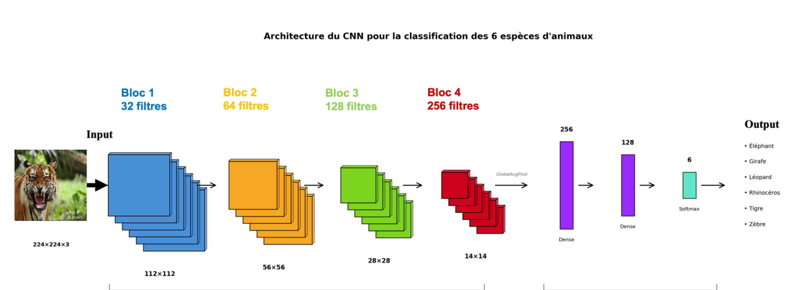
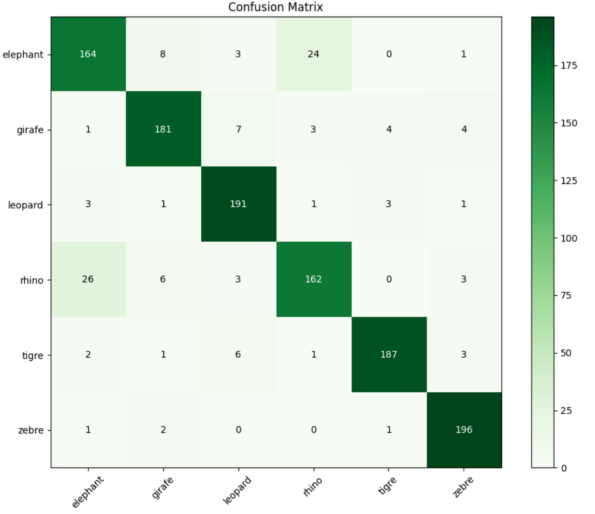
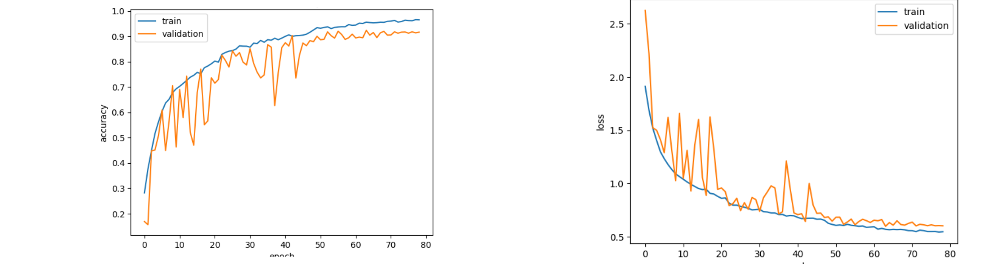
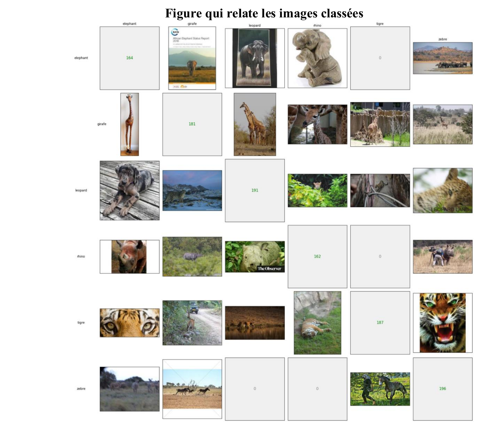

# Wildlife Image Classification — 6-class CNN

A convolutional neural network classifying wildlife images into six species
(elephant, giraffe, leopard, rhino, tiger, zebra), achieving **90.08% test
accuracy** (1,081 / 1,200) on a held-out balanced test set.

Built with TensorFlow / Keras as part of *INF7370 — Apprentissage automatique*
(Université du Québec à Montréal, Winter 2026).



---

## Results

| Metric | Value |
|---|---|
| **Test accuracy** | **90.08 %** (1,081 / 1,200) |
| Test loss | 0.6584 |
| Best epoch | 64 |
| Best validation accuracy during training | 96.54 % |
| Training time | 48.24 min on a Kaggle Tesla T4 |
| Classes | 6 (elephant, giraffe, leopard, rhino, tiger, zebra) |
| Training images | 6,160 (class-imbalanced) |
| Validation images | 1,540 |
| Test images | 1,200 (200 per class, balanced) |
| Input resolution | 224 × 224 × 3 |

### Confusion matrix



### Training curves



The validation accuracy is visibly noisy throughout training — a known artifact
of evaluating on a single fixed batch with `BatchNormalization` layers and
heavy `Dropout`. The mean trend (and the values selected by `ModelCheckpoint`
on the best `val_accuracy`) is what the test results reflect.

---

## Architecture

A four-block convolutional feature extractor followed by a global-average-pooled
classifier head.

**Feature extraction.** Four convolutional blocks with progressively wider
filters (32 → 64 → 128 → 256). Each block contains two `Conv2D(3×3, padding='same')`
layers, each followed by `BatchNormalization` and `ReLU`, then a `MaxPooling2D(2×2)`
and `Dropout(0.3)`. Spatial dimensions are reduced from 224 × 224 down to 14 × 14.

**Classifier head.** `GlobalAveragePooling2D` (chosen over `Flatten` to avoid
the ~50,176-dimensional vector that would have caused immediate overfitting on
this dataset size) → `Dense(256)` → `Dense(128)` → `Dense(6, softmax)`. Each
dense layer is followed by `BatchNormalization`, `ReLU`, and `Dropout(0.5)`.

### Key design choices

- **`label_smoothing=0.1`** on the categorical cross-entropy loss to reduce
  overconfidence on the imbalanced training distribution.
- **`class_weight='balanced'`** computed via `sklearn.utils.class_weight` to
  compensate for the heavy imbalance in the training set (1,600 tiger images
  vs. 640 giraffe images, so almost a 3× ratio between the most and least
  represented classes).
- **Adam optimizer** with `learning_rate=0.0003`.
- **`ReduceLROnPlateau`** (monitor `val_accuracy`, factor 0.5, patience 5) for
  finer adjustments late in training. Notable improvements at epochs 23, 53, 56
  and 64 each followed a learning-rate reduction.
- **`EarlyStopping`** (monitor `val_accuracy`, patience 15, `restore_best_weights=True`).
- **`ModelCheckpoint`** saving only the best `val_accuracy` snapshot.
- **Data augmentation** at training time only: rotation (±25°), zoom (20 %),
  shear (15 %), translation (10 %), horizontal flip, nearest-neighbor fill.

---

## Error analysis

The sample grid below shows one misclassified test image for each (true, predicted)
combination. Diagonal cells display the count of correctly classified images.



The most informative pattern in the confusion matrix is the **elephant ↔ rhino**
confusion: 24 elephants predicted as rhino + 26 rhinos predicted as elephant =
**50 errors out of 119 total (42 %)**. The two species share the visual features
this network learned to rely on — massive silhouettes, grayish skin tones, and
similar savanna backgrounds — and the model has no fine-grained cue (trunk,
horn) to break the tie at this resolution.

By contrast, the model excels on species with distinctive textures: zebra
98 % (196/200) and leopard 95.5 % (191/200). This confirms that the remaining
errors are concentrated on classes sharing global visual characteristics rather
than distributed evenly.

**Plausible improvements:**
- **Transfer learning** (ResNet50, EfficientNet) to leverage fine-grained
  features pre-learned on ImageNet, where elephants and rhinos are already
  separated.
- **Higher input resolution** (e.g., 299 × 299) to make distinctive small
  features (trunk, horn) more recoverable for the network.

---

## Project structure

```
animal-image-classification/
├── README.md
├── requirements.txt
├── LICENSE
├── .gitignore
├── src/
│   ├── model.py
│   └── evaluate.py
└── results/
    ├── architecture_diagram.png
    ├── confusion_matrix.png
    ├── training_curves.png
    └── sample_predictions.png
```

---

## Quick start

### 1. Clone and install

```bash
git clone https://github.com/majdabouhou/animal-image-classification.git
cd animal-image-classification
pip install -r requirements.txt
```

> **Apple Silicon (M1 / M2):** install `tensorflow-macos` and `tensorflow-metal`
> instead of plain `tensorflow` (the latter does not detect the Metal GPU and
> conflicts with the macos build).

### 2. Prepare the dataset

The data loaders expect this layout (Keras `flow_from_directory` convention):

```
data/
├── entrainement/
│   ├── elephant/
│   ├── girafe/
│   ├── leopard/
│   ├── rhino/
│   ├── tigre/
│   └── zebre/
├── validation/   (same six subfolders)
└── test/         (same six subfolders, 200 images each)
```

Update `MAIN_DATA_PATH` at the top of `src/model.py` and `src/evaluate.py` to
point at your local `data/` directory (the scripts default to the Kaggle
`/kaggle/input/...` path that was used to produce the reported results).

### 3. Train

```bash
python src/model.py
```

The best model (highest `val_accuracy`) is saved to `Model.keras`.

### 4. Evaluate

```bash
python src/evaluate.py
```

This loads the saved model, runs it on the test set, prints accuracy and loss,
and renders the confusion matrix plus the misclassification grid.

---

## Lessons learned

- **Class imbalance was the main bottleneck.** Combining `class_weight='balanced'`
  with `label_smoothing=0.1` gave the most consistent improvement over the
  naive baseline — more so than additional augmentation.
- **`GlobalAveragePooling2D` over `Flatten`.** `Flatten` would have produced a
  50,176-dimensional vector feeding into the dense head, which overfit
  immediately at this dataset size. Average pooling keeps the head at
  256 → 128 → 6 and trains noticeably more stably.
- **Validation-accuracy-based callbacks** beat loss-based ones on this
  imbalanced problem. The same callbacks monitoring `val_loss` were noisier
  and triggered early stopping prematurely.
- **The hard cases share global features, not subtle textures.** The
  elephant/rhino confusion alone accounts for 42 % of all test errors. Future
  work should target this pair specifically rather than chasing uniform
  improvement across the six classes.

---

## License

[MIT](LICENSE)

## Author

**Majda Bouhou** — Montréal, QC